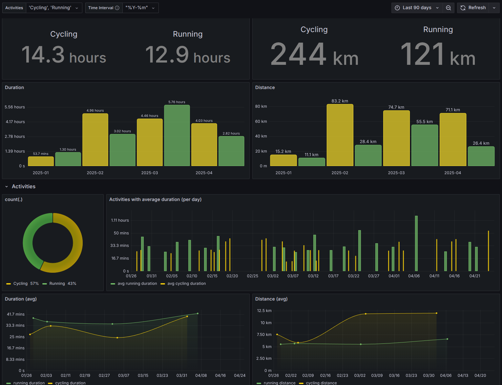
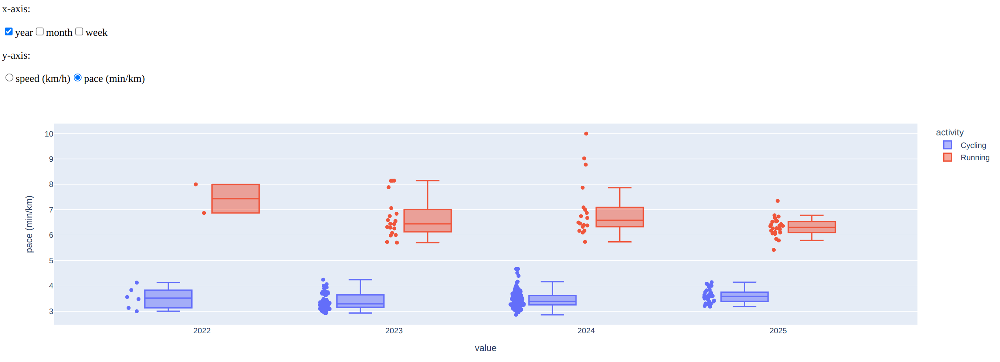

gpx-stats
=========

Dashboard visualizing stats based on gpx files.



## Setup

```bash
# install environment
$ uv run pre-commit install
```


## Usage

Add your gpx files to `data` (e.g., sync from your phone).

Load gpx files, generate metadata and save to sqlite database:
```bash
$ ./import.py data/<file>.gpx
```
If the file has no tracks (e.g., because its a manual entry)
then it will try the `tcx` file (should contain duration and distance).

Load all gpx files from a folder:
```bash
mkdir db
$ ./load.sh data db/gpx.db
```

Visualize the stats with
[grafana](https://grafana.com/docs/grafana/latest/)
at [localhost:3000](http://localhost:3000)
with default username and password `admin:admin`:
```bash
$ docker-compose up
# or with podman
$ podman compose up
```

Or a speed boxplot with a mini [dash app](http://localhost:8050):
```bash
$ uv sync --extra dashapp
$ uv run python app.py
```


## Development

### Testing

Run tests:
```bash
$ uv run pytest
```

Run integration tests (excluded by default):
```bash
$ uv run pytest tests/integration/
```

Run tests with coverage report:
```bash
$ uv run pytest --cov=stats_loader --cov-report=term-missing
```

Generate HTML coverage report:
```bash
$ uv run pytest --cov=stats_loader --cov-report=html
# Open htmlcov/index.html in browser
```

### Database Debugging

Debug database:
```bash
sqlite3 db/gpx.db
# list tables
> .tables
```

List latest entries:
```sql
SELECT * FROM files ORDER BY load_timestamp DESC LIMIT 5;
```
